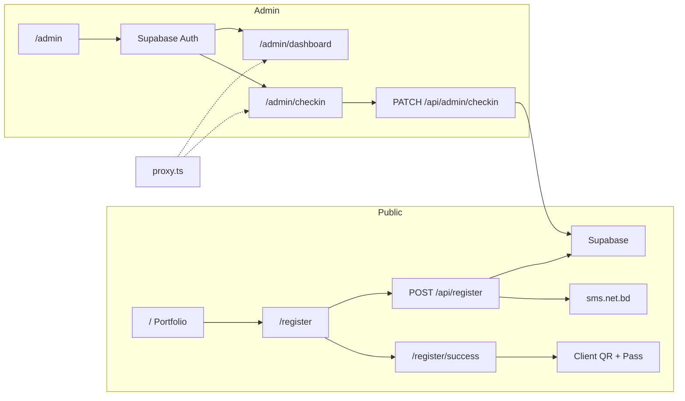

<div align="center">

# ⚡ ViperSport

**Fuad Abdul-Aziz portfolio & Argentina vs Austria live match registration**

[](https://nextjs.org/)
[](https://react.dev/)
[](https://www.typescriptlang.org/)
[](https://tailwindcss.com/)
[](https://supabase.com/)
[](https://vercel.com/)

[Live Site](https://vipersport.com) · [Register](https://vipersport.com/register) · [Documentation](./project.md) · [Design System](./Design.md)

<br />


<br />

> **Demo GIF** — add `docs/assets/demo.gif` and replace the image above for a full walkthrough preview.

</div>

---

## Table of Contents

- [Overview](#overview)
- [Core Features](#core-features)
- [Tech Stack](#tech-stack)
- [Screenshots](#screenshots)
- [Architecture](#architecture)
- [Quick Start](#quick-start)
- [Environment Variables](#environment-variables)
- [Scripts](#scripts)
- [Routes](#routes)
- [Project Structure](#project-structure)
- [Event Details](#event-details)
- [Documentation](#documentation)
- [License](#license)

---

## Overview

ViperSport is a **mobile-first Next.js MVP** built for the Bangladesh market. It combines a high-impact **Kinetic Dark** portfolio for Fuad Abdul-Aziz with a complete **free event registration** flow for the Argentina vs Austria World Cup live match show in Sylhet — including SMS confirmation, QR passes, and a protected admin check-in portal.

|              |                                                         |
| ------------ | ------------------------------------------------------- |
| **Event**    | Argentina vs Austria — Live Match Show & Fan Engagement |
| **Date**     | 22 June 2026 · 9:00 PM – 1:00 AM                        |
| **Venue**    | Shahi Eidgah Maidan, TV Gate, Sylhet, Bangladesh        |
| **Capacity** | 500+ registrations (free, no payment)                   |

---

## Core Features

<table>
<tr>
<td width="50%" valign="top">

### 🏠 Portfolio (`/`)

- Full-viewport **hero** with GSAP entrance animations
- **Animated stats** — 500M+ views, 1.4M+ followers
- **Live event banner** with coral “upcoming” accent
- About, collaborations, and **brand contact** form
- **Scroll-spy navigation** — desktop pill navbar + mobile bottom tabs
- Connection-aware animation skip for slow networks

</td>
<td width="50%" valign="top">

### 🎟️ Registration (`/register`)

- React Hook Form + Zod validation (BD phone format)
- **RegisterEventDetails** card with match, date, featured stars
- Rate-limited API with phone deduplication
- **SMS confirmation** via sms.net.bd (fire-and-forget)
- Success screen with **QR code**, confetti, downloadable **ViperSport Pass**

</td>
</tr>
<tr>
<td width="50%" valign="top">

### 🔐 Admin (`/admin/*`)

- Supabase Auth (email/password, no public signup)
- **Dashboard** — stats cards, searchable table, CSV export
- **Check-in** — camera QR scan + manual phone/name search
- Responsive **AdminShell** with sidebar and mobile nav
- Protected via `proxy.ts` (not middleware)

</td>
<td width="50%" valign="top">

### ⚙️ Platform

- Cloudinary CDN + `next/image` with blur placeholders
- React 19 Compiler enabled
- Vercel Speed Insights
- Supabase RLS + migrations
- TypeScript strict — zero `any`

</td>
</tr>
</table>

---

## Tech Stack

| Layer               | Technology                                              |
| ------------------- | ------------------------------------------------------- |
| **Framework**       | Next.js 16 (App Router)                                 |
| **UI**              | React 19, Tailwind CSS v4, shadcn/ui primitives         |
| **Animation**       | GSAP                                                    |
| **Forms & State**   | React Hook Form + Zod, Zustand                          |
| **Database & Auth** | Supabase (PostgreSQL)                                   |
| **Media**           | Cloudinary, `next/image`                                |
| **SMS**             | sms.net.bd REST API                                     |
| **QR**              | `qrcode` (client generate), `html5-qrcode` (admin scan) |
| **Deploy**          | Vercel                                                  |

---

## Screenshots

|            Home Hero             |            Event Banner             |           Registration            |
| :------------------------------: | :---------------------------------: | :-------------------------------: |
| Portfolio hero with split layout | Live event CTA with register button | Event details + registration form |

> Add captures to `docs/assets/` (`home.png`, `register.png`, `admin.png`, `demo.gif`) for richer README previews.

---

## Architecture



<details>
<summary><strong>Data flow — registration</strong></summary>

1. User submits form → `POST /api/register` (IP rate-limited, 5 req/min)
2. Phone normalized & deduplicated → insert or return existing row
3. SMS sent asynchronously — registration succeeds even if SMS fails
4. Redirect to `/register/success?id={registration_id}`
5. Client fetches registration, renders QR and downloadable pass image

</details>

---

## Quick Start

### Prerequisites

- Node.js 20+
- [Supabase](https://supabase.com/) project
- [sms.net.bd](https://sms.net.bd/) API key (for SMS)
- [Cloudinary](https://cloudinary.com/) account (optional, for CDN images)

### Install & run

```bash
git clone https://github.com/your-org/viper-sport.git
cd viper-sport
npm install
cp .env.example .env.local   # fill in credentials
npm run dev
```

Open [http://localhost:3000](http://localhost:3000).

### Verify

```bash
npm run lint
npm run typecheck
npm run build
```

---

## Environment Variables

Copy `.env.example` to `.env.local`:

```env
# Supabase
NEXT_PUBLIC_SUPABASE_URL=
NEXT_PUBLIC_SUPABASE_PUBLISHABLE_KEY=
NEXT_PUBLIC_SUPABASE_ANON_KEY=
SUPABASE_SERVICE_ROLE_KEY=

# SMS (sms.net.bd)
SMS_NET_BD_API_KEY=

# Cloudinary
NEXT_PUBLIC_CLOUDINARY_CLOUD_NAME=
CLOUDINARY_API_KEY=
CLOUDINARY_API_SECRET=
```

| Variable                    | Scope            | Purpose                |
| --------------------------- | ---------------- | ---------------------- |
| `NEXT_PUBLIC_SUPABASE_*`    | Browser + server | Supabase client        |
| `SUPABASE_SERVICE_ROLE_KEY` | Server only      | Admin API routes       |
| `SMS_NET_BD_API_KEY`        | Server only      | Registration SMS       |
| `CLOUDINARY_*`              | Mixed            | Image CDN & transforms |

---

## Scripts

| Command             | Description              |
| ------------------- | ------------------------ |
| `npm run dev`       | Start development server |
| `npm run build`     | Production build         |
| `npm run start`     | Serve production build   |
| `npm run lint`      | ESLint                   |
| `npm run typecheck` | TypeScript `--noEmit`    |

---

## Routes

| Route               | Access | Description                 |
| ------------------- | ------ | --------------------------- |
| `/`                 | Public | Portfolio homepage          |
| `/register`         | Public | Event registration form     |
| `/register/success` | Public | QR pass & confirmation      |
| `/admin`            | Public | Admin login                 |
| `/admin/dashboard`  | Auth   | Stats + registrations table |
| `/admin/checkin`    | Auth   | QR scanner + manual search  |

### API

| Method  | Endpoint                   | Description                         |
| ------- | -------------------------- | ----------------------------------- |
| `POST`  | `/api/register`            | Create registration, trigger SMS    |
| `GET`   | `/api/register/[id]`       | Fetch registration for success page |
| `GET`   | `/api/admin/registrations` | List all registrations (auth)       |
| `PATCH` | `/api/admin/checkin`       | Mark attendee checked in (auth)     |

---

## Project Structure

```
viper-sport/
├── app/
│   ├── (public)/          # Portfolio, register, success
│   ├── (admin)/admin/     # Login, dashboard, check-in
│   └── api/               # Register & admin route handlers
├── components/
│   ├── home/              # Hero, Stats, EventBanner, nav, footer
│   ├── register/          # Form, event details, success card
│   ├── admin/             # Shell, table, QR scanner, stats
│   └── ui/                # Button, Input, Badge, Toaster
├── hooks/                 # useActiveSection (scroll spy)
├── lib/                   # Supabase, SMS, QR, validation, Cloudinary
├── supabase/migrations/   # Schema & RLS
├── proxy.ts               # Admin route protection
└── types/index.ts         # Shared TypeScript types
```

---

## Event Details

| Field           | Value                                       |
| --------------- | ------------------------------------------- |
| **Match**       | Argentina vs Austria                        |
| **Date & Time** | 22 June 2026 · 9:00 PM                      |
| **Venue**       | Shahi Eidgah Maidan, TV Gate, Sylhet        |
| **Ticket**      | Free (general admission)                    |
| **Featuring**   | Fahmidul Islam, Topu Barman, Md. Saad Uddin |

---

## Documentation

| File                         | Contents                                       |
| ---------------------------- | ---------------------------------------------- |
| [`project.md`](./project.md) | Product scope, routes, schema, API, resilience |
| [`Design.md`](./Design.md)   | Kinetic Dark design tokens & guidelines        |
| [`AGENTS.md`](./AGENTS.md)   | AI / contributor coding conventions            |

---

## License

Private project — © ViperSport · Fuad Abdul-Aziz. All rights reserved.
